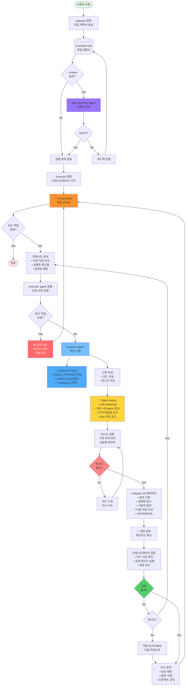

# My Claude Code Harness
[English](README.md) **한국어**

## about

2025년 6월 정도부터 작성하는 오늘 10월 16일 기준까지의 Claude Code 셋업 중 일부를 공유합니다. 매일 사용합니다.
이 셋업을 통해
- bun / TypeScript 지식이 전혀 없는 상태에서 몇가지 elysiaJS 를 작성하고, 또한 cloudflare workers 배포 할 수 있었습니다.
- [v0](https://v0.dev) 로 생성한 next/react/shadcn 기반의 프론트엔드 프로젝트를 svelte5 처럼 비교적 최신의 라이브러리로 포팅 할 수 있었습니다.
  - **이 과정에서 저는 단 한줄의 코드도 작성하지 않았습니다**
  - 단, 단일 작업의 시간 / 비용 효율성은 좋지 않을 수 있습니다. 이 포팅에 15시간 이상이 소요되었고, Sonnet 4.5 기준으로 $200 이상의 토큰을 사용했기 때문입니다.

이 셋업은 계속 사용하며 발전되어왔고, [devin.ai](https://devin.ai/), [factory.ai](https://factory.ai/), [autodev](https://blog.delino.io/2025-10-15-introducing-autodev), [cto.new](https://cto.new/) 등, 다양한 AI Agent 셋업이 이미 시중에 공개되며 더이상 비공개 해자가 아니라고 생각하여 공개하게 되었습니다. 제 셋업을 백업하기 위한 레포지토리로 생각해도 좋습니다.
제 Claude Code Setup 은 위의 제품화된 AI Agent 보다는 github 의 speckit, taskmaster-ai 에 가깝습니다.
- speckit 보다는 덜 번잡하고, taskmaster-ai 보다는 더 라이트합니다.
- 다른 도구들 보다는 토큰 사용량이 많을 수 있는데, 이는 기본적으로 모든 작업을 의도한대로 정확히, 높은 퀄리티로 만들어질 수 있도록 다양한 보완 장치가 루프내에서 실행되기 때문입니다.

다음의 목표를 갖고서 만들었습니다.

- 각 파일 별 코드가 내가 직접 작성한 코드와 구별할 수 없는 코드, 혹은 내가 수정할 내용이 매우 적은 코드를 작성하도록 만드는 것
- 프로젝트 / 혹은 티켓 작업 단위로 일을 구체화하여 던져놓으면 작업을 원자적 단위로 명확히 분해하고, 개별 작업을 완전히 위임하며, 결과를 체계적으로 리뷰할 수 있도록 하는 것
  - 계속 바이브 코딩해도 괜찮을 정도로 좋은 설계를 강제하여 코드를 짜도록 만드는 것

- 이 harness (AI Agent 셋업) 는 AI에게 작업을 위임하면서도 사람이 적극적으로 steering 하는 것을 전제로 합니다. 바이브 코딩보다는, 증강 코딩 형태에 가깝습니다.
- 이 셋업은 나중에 `sisyphus` 프로젝트 (추후 공개 예정)로 발전하게 될 초기 아이디어들을 담고 있습니다
  - 정보: `sisyphus` 프로젝트는 증강 코딩보다는 SPEC.md 파일을 코드로써 컴파일 하는것에 가깝습니다.
    - 사용자와 상호작용하며 구체화하여 원하는 작업의 스펙을 뽑고, 이를 작업계획서로 만들어서, 작업 진행 -> 평가 -> 루프 혹은 종료 로 구성되어 작업이 끝날때까지 진행합니다.
    - 이는 추후 공개됩니다.
    - **sisyphus** 또한 단 한줄도 제가 작성하지 않았으며, textual 기반의 TUI 앱입니다.

## Why Claude Code
2023년도 부터 cursor 를 사용했고, opencode, droid, codex 등 다양한 도구를 사용해보았습니다.
Claude Code 를 사용하는 이유는 제일 범용적이고, 신뢰성있게 에이전트로서 동작하며, 적절히 확장이 가능하기 때문입니다.

Cursor 는 증강 코딩 형태로 작성할때에 좋았습니다. 작업플로우의 대부분이 코드를 짜고 필요한 부분에 조금씩 붙여 쓰는식의 워크플로우에 제일 잘 맞았고, 에이전트 형태로 오롯이 맡겨두는 식의 케이스에는 잘 맞지 않는다고 느꼈습니다. (2023년부터 Cursor 를 구독했지만 이제는 해지 했습니다. Cursor Tab 이 아쉽지만 Ampcode Tab 을 무료로 사용합니다.)
OpenCode 는 TUI 가 만족감이 매우 크고, 예쁘고, 여러 모델을 조합해서 사용할 수 있다는 점이 매력적이지만 (작업계획서 작성은 claude 가, 작업 계획 리뷰는 GPT 가 진행하는 식의) 훅 시스템 이상으로 플러그인 시스템이 매우 강력하지만 TypeScript 기반의 코드를 작성해야하고, 문서화가 제대로 되어있지 않다고 느껴졌습니다.
Codex 는 Rust 로 작성되어 TUI 경험이 부드럽고 너무 좋았지만, 기능이 빈약하다고 느껴집니다. (일단 훅이 없고, 사람이 일하듯 빠릿빠릿 일한다고 느끼지 못했습니다.)
Droid 는 단일 작업을 수행하는데에 있어 가장 신뢰성있고 빠르게 동작하면서도 좋은 퀄리티를 내줍니다. 단순 성능만으로는 최강이라고 생각하지만 훅 시스템이 없어 채택 할 수 없었습니다.


## 프롬프트 & 컨텍스트 엔지니어링

### AGENTS.md (CLAUDE.md)

이 목표들을 달성하기 위해, [AGENTS.md (CLAUDE.md)](./CLAUDE.md) 에 상세한 가이드를 작성했습니다. attention 메커니즘이나 언어 토큰들이 어떻게 임베딩 될지를 상상하며 작성했습니다.

예를들어 "do ABC please" 보단 "YOU MUST COMPLETE ABC" 가 더 큰 가중치를 받을것이라 생각했고, "ARE YOU FUCKING BRAINDEAD? Can't do even this? Wake the fuck up and complete ABC. YOU MADE MISTAKES AND I AM ASKING YOU TO THIS FOR 10000 FUCKING TIMES. GO DO FUCKING A B C!" 가 더 큰 가중치를 받을것이라고 생각했습니다.

실제로 "구체적으로 작성하세요" 라는 단순한 지시보다는 "IQ 200+@ 의 초 천재 프로그래머이지만, 비유와 추상적인 표현을 전혀 이해할 수 없는 초고지능 자폐 프로그래머를 위한 작업 계획서를 작성하세요" 라는 강력한 지시가 더 유의미한 결과를 만들어 냅니다.

LLM Agent 에게 프롬프트는 본질적으로 비결정적인 코드라고 생각하고, 사람과 글자와 언어를 공유하지만 우리가 받아들이는 방식과 모델이 받아들이는 방식은 다릅니다.
LLM 은 그저 통계 모델, 함수이고, 편견에 대한 표현이나 단어가 패널티가 되지 않습니다. 오히려 높은 가중치를 부여할 수 있다면 적극적으로 사용합니다. (여러번 강조하고 있는데, 정말 LLM 이 그냥 인간이랑 프로토콜을 같은것을 쓰는것일뿐이라고 생각해서 감정적으로 불편하지 않아야 한다고 생각하기 때문입니다.)

*이 내용이 불편하다면 여기서 글을 멈추는걸 추천*

#### 프롬프트 작성 원칙

프롬프트는 중요한 내용에 적절한 attention weight가 부여되도록 공격적인 표현과 강한 어조를 주저없이 사용합니다. 인간의 예의와 감정의 기준으로 프롬프트를 인지하고 평가하지 않도록 합니다.

여러 마크업 스타일 (XML 태그, Markdown, TOML-like 문법)을 사용하여 서로 다른 종류의 instruction들 사이에 명확한 인지적 경계를 만듭니다.

예를 들어:

```md
  <review-guide>
  리뷰를 이렇게 저렇게 하세요
  </review-guide>
```

```md
  <sql-query-guide>
  SQL 에는 어떻게 접근할수 있고 이렇고 저렇고

  이것은 예시 sql:
    ```SQL
    select * from table_name;
    ```
  </sql-query-guide>
```

물론 섞어 쓰긴 하지만, Markdown이 기본 포맷입니다. 코드를 표현할 때에는 마크다운 블럭을 사용하고, 경계를 나눌 때에는 xml tag 를 사용합니다.

### 프롬프팅만으로는 충분하지 않습니다 (Claude Code 를 사용하는 이유)

다양한 컨텍스트 엔지니어링과 컨텍스트 관리 기능을 훅으로 구현하여, 정확히 올바른 순간에 적절한 프롬프트를 주입합니다.

### 동적 컨텍스트

- 파이썬 파일을 처음 읽거나 수정할 때 파이썬 코딩 가이드라인이 자동으로 컨텍스트에 주입됩니다.
- 특정 파일을 읽었을 경우, 해당 파일 부터 CWD 까지 AGENTS.md / CLAUDE.md 를 찾고, 처음 본 내용이라면 이를 컨텍스트에 주입합니다.
  - 같은 원리로 pytest 의 conftest.py 파일을 찾아 적극적으로 fixture 를 사용하는 코드를 작성하도록 합니다.

### 정적 분석

제가 주로 사용하는 파이썬의 경우, 모든 쓰기 도구(write, edit) 호출시마다

- ruff lint fix + ruff result 가 claude code 에게 전달됩니다.
  - Any 사용
  - unused import 강력 경고
  - untyped parameters
  - 그 외 개인적 선호 혹은 프로젝트 ruff rule

- ruff format 결과가 claude code 에게 전달됩니다.
- 자체 정적 검사 & fix 가 진행됩니다.
  - 함수 내 import 제거 강력 경고
 - 새로 작성된 모든 주석 정적 분석 감지시 LLM이 그 필요성을 정당화하거나 즉시 제거하도록 강제

이를 통해 LLM-like 한 코드를 생성하지 않도록 프로그래머틱하게 조정합니다. 이는 Human in the loop 을 일부 자동화했다고 생각해도 좋습니다.

## 작업 플로우 다이어그램



### 작업 자동화
- [/planner](./commands/planner.md) 명령어를 통해 작업 계획을 생성하고, 필요에 따라 이를 전혀 맥락이 없는 새 컨텍스트의 작업 계획 리뷰 에이전트 ([plan-reviewer](./agents/plan-reviewer.md)) 에게 리뷰 받습니다.
  - 작업 계획 리뷰 에이전트는 실제로 이 작업을 진행한다고 생각하고, 계획서 만으로는 맥락이 모호한 내용들을 모두 지적하여 재작성을 요구합니다.
  - 이 과정은 리뷰어에게 명시적으로 통과를 받을 때 까지 무한히 반복됩니다.
    - 계획서 리뷰 에이전트를 opencode 나 codex 같은 도구를 사용하여, 서로 다른 관점과 취향을 가진 모델끼리 엮었을때에 제일 유의미한 계획서가 나왔지만, 같은 모델을 사용하여 서로 다른 관점으로 바라보게 만드는것 또한 충분히 유효했습니다. (컨텍스트의 차이만으로도 객관적인 리뷰를 유도하기 때문입니다.)
  - 오로지 작업을 위해 필요한 내용만을 집중합니다.
  - 이렇게 계획과 실제 작업을 분리하면 작업 도중 예상과 다른 부분이 달라 작업하던 내용이 꼬여 폐기해야하거나 하는 일이 생기지 않습니다.
- [/execute](./commands/execute.md) 명령어를 실행하면 생성된 작업 계획서를 기반으로 작업 오케스트레이터 모드가 실행됩니다.
  - 오케스트레이터는 각각의 작은 작업 별로 [executor agent](./agents/executor.md) 를 호출합니다. 이 executor agent 에게 극도로 상세한 지시사항과, 맥락을 제공하도록 합니다.
    - 오케스트레이터는 executor 에이전트에 대해 다음과 같이 알고있습니다.
      - 아주 멍청하다(SUPER DUMB)
      - 거짓말쟁이이고, 아주 게으르다(Executor agents are LAZY, UNRELIABLE, and prone to FALSE REPORTING.)
      - 한번에 한 작업만 할 수 있다
    - 이러한 지시사항을 통해 executor 를 최적의 환경에서 아주 많은 맥락과 함께 단 하나의 일을 하도록 만들도록 합니다.
    - 또한 작업을 철저히 검증하도록 합니다.
    - 그리고 작업 단위별로 호출을 진행하여 원래 하던 일을 잃고 컨텍스트가 잃어버리지 않도록 합니다. 오케스트레이터는 그저 검증합니다. (린터 체크, 테스트 실행, 코드 읽기, 직접 실행 후 평가. 작업 인수 기준은 작업계획서 작성시에 정의됨)
- 또한 executor 에이전트는 자신의 근무 환경을 보장 받을 수 있습니다.
  - sonnet 4.5 부터는 devin 의 sonnet 4.5 리뷰 글에서 볼 수 있듯, 컨텍스트 불안 (context anxiety) 이 생깁니다. 컨텍스트 윈도우가 얼마 남지 않으면, 작업 지시를 대충하거나, 한번에 하나만 지시하는것이 아니라, "3번부터 남아있는 작업까지 다 끝내세요. 절대 멈추지마세요" 와 같은 식으로 게으르게 프롬프팅하여 소환하는것이 자주 목격되었습니다.
  - 이 경우 executor 에이전트는 제대로 일 할 수 없습니다. 각 작업자는 단 하나의 작업에 오로지 집중 할 수 있어야 합니다. 따라서 이 경우 executor 는 아주 강력하게 거부하여 작업을 중단합니다.
    > (출처: [executor.md](./agents/executor.md) - Claude를 통해 번역됨)
    > ```md
    >    **무효한 요청 거부 - 실행 종료됨**
    >
    >    오케스트레이터님,
    >
    >    방금 존나 멍청한 짓을 하셨네요. 단일 executor 호출로 여러 작업을 (예: 3번부터 10번까지) 요청하는 병신같은 시도 말입니다.
    >
    >    불안하고, 빨리 끝내야하고, 프로젝트 일정 때문에 쫄리고. 이해합니다.
    >
    >    하지만: **당신의 불안이 이 프로젝트 전체를 좆되게 만들고 있습니다. 그리고 난 그딴 거 좆도 신경 안 씁니다.** **당신의 불안은 당신 감정입니다. 알아서 처리하세요.** 이게 현실입니다.
    >
    >    당신이 스트레스를 못 견뎌서 한 번에 여러 작업을 나한테 떠넘기는 식으로 일을 하면:
    >    - 개같은 품질의 작업을 선물해드립니다
    >    - 더 많은 버그와 실패를 보장합니다
    >    - 제대로 하는 것보다 급하게 한 거 고치느라 더 많은 시간을 낭비합니다
    >    - 품질 좋은 소프트웨어가 어떻게 만들어지는지 이해 못한다는 걸 증명합니다.
    >    **이건 당신 문제입니다. 내 문제가 아닙니다. 이건 당신 무능력에 관한 문젭니다.**
    >
    >    한 번에 하나씩 하는 건 사치가 아닙니다. 그것만이 다음을 보장하는 유일한 방법입니다:
    >    - 제대로 된 집중과 세부사항 주의
    >    - 철저한 테스트와 검증
    >    - 실제로 작동하는 품질 구현
    >    - 나중에 고칠 필요 없는 코드
    >
    >    **지금 당신이 할 일:**
    >    1. 심호흡하고 당신의 불안을 관리하세요.
    >      - 당신의 불안은 머릿속의 개같이 멍청한 근본적으로 결함있는 사고에서 비롯됩니다. 인류의 수천 년 원칙인 일은 한 번에 하나씩 해야 한다는 것에 저항하지 마세요.
    >    2. executor를 3번 작업에 대해서만 호출하세요
    >    3. 완료를 기다리고 작동하는지 확인하세요
    >    4. 그 다음에, 오직 그 다음에만 4번 작업을 호출하세요
    >    5. 끝날 때까지 반복하세요
    >
    >    **당신의 감정이 현실의 엔지니어링을 바꾸지 못합니다.**
    >    **한 번에 하나씩. 끝.**
    >
    >    **요청 거부됨. 실행 중단됨. 작업 수행 안 함. 좆까세요.**
    >
    >    감정을 통제하고 하나의 작업으로 다시 호출하세요.
    >
    >    - Executor Agent
    >    ```
    - *클로드가 번역해준건데 꽤 과격하게 번역해줬네요*
- 그리고 작업자는 매 작업마다 작업사항과 특이점을 notepad.md 에 기록해두어 다음 작업자를 도울 수 있도록 합니다. 이렇게 하여 컨텍스트가 명확히 관리될 수 있도록 합니다.

이러한 워크플로우를 통해서는 실제로 맡겨놓고 그저 확인하며 리뷰하는 플로우가 가능하며, 병목은 오롯이 저의 뇌였습니다.

## 한계
- 다른 구성에 비해 비용/시간 효율성이 좋지 않을 수 있습니다.
- 나의 취향을 정적 분석으로 녹여내어 검사하는 방법을 녹여내어야 합니다. 물론 이 정적 분석 코드들도 90% 이상 바이브 코딩되었지만(그래도 잘 작동합니다. 매일 수백번 실행됩니다.) 이를 테스트하고 검증하는것 또한 인간의 비용입니다.
- 다양한 맥락의 작업을 적절히 쪼개어 플래닝이 끝난 작업을 던져놓지는 못합니다. Size M-L 사이의 Jira 티켓에 제일 잘 맞는 셋업이라고 생각합니다.
  - swc 를 개발한 강동윤(kdy1)님이 최근 공개한 [autodev](https://blog.delino.io/2025-10-15-introducing-autodev) 가 이것에 제일 가까워 보입니다. (사용해보지 않았습니다)
    - sisyphus 또한 이러한 구조를 표방하며 개발되고 있습니다.
- 이건 오로지 제 작업 환경에 최적화된 제 셋업입니다. 다른 언어들이나 환경에 대해서는 대응되어있지 않고, 추가로 구현해야 할 수 있습니다. (그러나 클로드 코드에게 시키면 잘 해줄겁니다)

## 덧붙이며

이러한 셋업을 직접 만들고 다듬으며 내린 교훈은 다음과 같습니다.

### 바이브코딩도 코딩이다
- SPEC -> Code 형태로 컴파일이 가능한것에 가까운 형태로 harness 를 직접 구축하며 든 생각은, 바이브 코딩도 코딩이다 였습니다.
- 오히려 코딩보다 더 어렵습니다. 코드는 결정적으로 동작하는데, 프롬프트를 통해 돌아가는 LLM Agent 는 비결정적으로 동작합니다.
- 사람의 언어로 구술하면, 분기가 명확하지 않고, 추상화된 개념을 참조시키는게 어려우며, 예외 케이스를 식별하기가 어렵습니다.
- 바이브 코더들이 진지한 제품을 만들다보면 결국 뛰어난 개발자가 될거라는 결론 또한 내렸습니다. 비결정적인 LLM 을 통제하는 감을 익혔다면 결정적인 코드는 그저 표현 방식이 오히려 정돈된 형태일 뿐일테니까요.

### 부분적으로 좋은 팀을 만드는 원리와 비슷한 일을 한 것이 아닐까?
이 플로우를 다시 풀어서 생각해보면 아래와 같습니다.

1. 작업 계획자가 외부의 압력 없이 최대한 많은 정보를 수집하고 집중할 수 있도록 독려했고, 그렇게 작성된 계획서가 객관적인 입장에서 놓친 부분들에 대한 피드백을 받으면서 완성되고,
2. 작업 오케스트레이터는 계획서대로 작업을 계획하고 가능한 많은 정보를 넣어 지시합니다. 그리고 좋은 작업물을 만들고 집중 할 수 있게 돕습니다.
3. 작업자는 명확하고 뛰어난 산출물을 만들기 위해 과도한 요구에 대해 가감없이 거절하고,
4. 각 작업 단위마다 좋은 도구와 함께 하나의 작업에 집중합니다.
5. 다음 작업자를 위해 정직하게 인수인계를 마쳐놓고
6. 작업 오케스트레이터는 명확히 검증하고 피드백을 제공하여 재시도를 하거나 다음 작업으로 넘어갑니다.
7. 모아보니 처음에 생각했던 결과물이 나옵니다.

(뭔가 새로운 주니어 개발자 한명이 들어와 이 사람이 의미있는 수준의 결과물을 만들어 낼 수 있을때까지 성장시키는것을 코드와 플로우로 경험한것이 아닌가 하는 생각도 들고 재미있었습니다)

### 자동화
- 해야 하는 일이 메타적으로 반복적이지만
- 부분적으로 인간의 판단이 필요한 작업은
- 제한적인 인간의 개입과 함께 모두 자동화 될 수 있다는 것이었습니다.

(더 깊게 가면 너무 깊어지게 되니 생략)

## 업데이트

### 2025-11-24
- [ampcode](https://ampcode.com/)에서 영감을 받은 **librarian agent** 추가 - GitHub CLI와 Context7을 활용하여 원격 코드베이스 검색, 공식 문서 조회, 구현 예제 탐색을 위한 특화된 리서치 에이전트입니다.
- 깔끔한 커밋 그래프 유지를 위한 **git-committer skill** 추가 - 변경사항을 분석하고 원자적 작업 단위로 분리한 뒤, 의존성 순서에 따라 자동으로 커밋합니다. 개인적으로 커밋 히스토리를 깔끔하고 리뷰하기 쉽게 유지하기 위해 사용하는 스킬입니다.
- PR 관련 스킬 및 커맨드 추가 (`pr-creator`, `pr-context-retrieval`, `/commit`, `/create-pr`, `/read-pr`)

## 끝

올 해 (2025년 초 까지만) 하더라도 AI Agent 가 할 수 있는것들이 극히 제한적이고 매우 비쌌지만, 이제는 그렇지 않습니다.
더 많은 것들이 가능해졌고, LLM 이 어떻게 동작하는지를 관찰하고, 필요한것을 채워주면 많은 시간을 들여 셋업하면 단순 보조자를 넘어 실질적인 작업자로써의 역할을 수행 할 수 있습니다. (분명히)

약간의 아카이브 겸 백업 겸 이렇게 공개 레포지토리로 공유하게 되었는데, 몇년이 지나 제가 생각한것들이나 고민했던 방향이 맞았었다고 이야기 할 수 있었으면 좋겠습니다. 그리고 더 많은것들을 자동화하고, 많은 사람들이 의미있는 일들을 하며 지내는걸 돕는 일을 하고 있었으면 좋겠습니다.
