# My Claude Code Harness
**English** [한국어](README.ko.md)

## about

This is part of my Claude Code setup that I've been crafting since around June 2025, up to today, October 16th. I use it daily.
Through this setup:
- Starting with zero knowledge of bun/TypeScript, I was able to write several elysiaJS applications and deploy to Cloudflare Workers.
- I successfully ported a next/react/shadcn-based frontend project generated by [v0](https://v0.dev) to relatively modern libraries like Svelte 5.
  - **I didn't write a single line of code during this entire process**
  - However, the time/cost efficiency for single tasks may not be optimal. The porting took over 15 hours and consumed more than $200 worth of tokens on Sonnet 4.5.

This setup has continuously evolved through use, and I've decided to make it public since various AI Agent setups like [devin.ai](https://devin.ai/), [factory.ai](https://factory.ai/), [autodev](https://blog.delino.io/2025-10-15-introducing-autodev), and [cto.new](https://cto.new/) are already publicly available, making this no longer a secret weapon. You can also think of this as a repository for backing up my setup.
My Claude Code Setup is closer to GitHub's speckit and taskmaster-ai than the productized AI Agents mentioned above.
- It's less convoluted than speckit, and lighter than taskmaster-ai.
- It may use more tokens than other tools, primarily because various safeguards run in loops to ensure all tasks are completed accurately and with high quality as intended.

I created this with the following goals:

- Write code that's indistinguishable from what I'd write myself, or requires minimal modifications
- Break down project or ticket-level work into concrete tasks, clearly decompose them into atomic units, fully delegate individual tasks, and systematically review results
  - Force good design that's robust enough for continuous vibe-coding

- This harness (AI Agent setup) assumes active human steering while delegating work to AI. It's closer to augmented coding than vibe coding.
- This setup contains early ideas that will later evolve into the `sisyphus` project (to be released)
  - Info: The `sisyphus` project is closer to compiling a SPEC.md file into code.
    - It interacts with users to extract and refine work specs, creates work plans, then proceeds through work → evaluation → loop or exit until completion.
    - This will be released later.
    - **sisyphus** was also written without me typing a single line, and is a textual-based TUI app.

## Why Claude Code
I've been using Cursor since 2023, and have tried various tools like opencode, droid, codex, and more.
I use Claude Code because it's the most versatile, reliably operates as an agent, and is appropriately extensible.

Cursor was great for augmented coding workflows. It worked best for workflows where you write most code and incrementally add small pieces. It didn't fit well for cases where you purely delegate work as an agent. (I've been subscribing to Cursor since 2023 but have now cancelled. I miss Cursor Tab, but I use Ampcode Tab for free.)
OpenCode has a very satisfying and beautiful TUI, and the ability to combine multiple models is attractive (like having Claude write work plans and GPT review them). Its plugin system is even more powerful than hooks, but requires writing TypeScript-based code and feels poorly documented.
Codex, written in Rust, has a smooth and excellent TUI experience, but feels lacking in features. (No hooks, and doesn't feel like it works as quickly and efficiently as a person would.)
Droid performs single tasks most reliably, quickly, and with good quality. I think it's the strongest in terms of pure performance, but couldn't adopt it due to lack of a hook system.


## Prompt & Context Engineering

### AGENTS.md (CLAUDE.md)

To achieve these goals, I wrote detailed guides in [AGENTS.md (CLAUDE.md)](./CLAUDE.md). I wrote them while imagining how attention mechanisms work and how language tokens would be embedded.

For example, I thought "YOU MUST COMPLETE ABC" would receive more weight than "do ABC please", and "ARE YOU FUCKING BRAINDEAD? Can't do even this? Wake the fuck up and complete ABC. YOU MADE MISTAKES AND I AM ASKING YOU TO THIS FOR 10000 FUCKING TIMES. GO DO FUCKING A B C!" would receive even more weight.

In practice, a powerful instruction like "Write a work plan for a super-genius autistic programmer with 200+ IQ who is brilliant but cannot understand metaphors or abstract expressions at all" produces more meaningful results than a simple "write specifically" instruction.

I think of prompts to LLM Agents as essentially non-deterministic code. While they share letters and language with humans, the way we perceive them differs from how models perceive them.
LLMs are just statistical models, functions, and expressions or words about bias don't penalize them. Rather, I actively use them if they can assign higher weights. (I emphasize this repeatedly because I truly believe LLMs just use the same protocol as humans, and we shouldn't feel emotionally uncomfortable about this.)

#### Prompt Writing Principles

Prompts freely use aggressive expressions and strong tones to assign appropriate attention weights to important content. Don't perceive or evaluate prompts by human standards of courtesy and emotion.

I use multiple markup styles (XML tags, Markdown, TOML-like syntax) to create clear cognitive boundaries between different types of instructions.

For example:

```md
  <review-guide>
  Review like this and that
  </review-guide>
```

```md
  <sql-query-guide>
  Here's how you can access SQL and this and that

  This is example sql:
    ```SQL
    select * from table_name;
    ```
  </sql-query-guide>
```

While I mix styles, Markdown is the base format. I use markdown blocks for code, and XML tags for boundaries.

### Prompting Alone Isn't Enough (Why I Use Claude Code)

I implement various context engineering and management features as hooks to inject the right prompts at exactly the right moments.

### Dynamic Context

- Python coding guidelines are automatically injected into context when reading or modifying Python files for the first time.
- When reading specific files, it searches for AGENTS.md/CLAUDE.md from that file to CWD, and injects new content into context.
  - Similarly, it finds pytest's conftest.py files to encourage code that actively uses fixtures.

### Static Analysis

For Python, which I mainly use, every write tool (write, edit) call triggers:

- ruff lint fix + ruff results are passed to Claude Code
  - Any usage
  - Strong warnings for unused imports
  - Untyped parameters
  - Other personal preferences or project ruff rules

- ruff format results are passed to Claude Code
- Custom static checks & fixes proceed
  - Strong warnings for imports inside functions
  - Force LLM to justify or immediately remove all newly written comments detected by static analysis

This programmatically adjusts to prevent generating LLM-like code. Think of this as partially automating Human in the Loop.

## Workflow Diagram

```mermaid
graph TB
    Start([User Request]) --> PlannerCmd["/planner command<br/>Generate work plan"]

    PlannerCmd --> TodoList[("ai-todolist.md<br/>Work Plan")]

    TodoList --> ReviewCheck{--review<br/>option?}
    ReviewCheck -->|Yes| PlanReviewer["plan-reviewer agent<br/>Review plan"]
    ReviewCheck -->|No| ExecuteReady[Ready to Execute]

    PlanReviewer --> ReviewResult{OKAY?}
    ReviewResult -->|No| PlannerFeedback[Apply Feedback]
    PlannerFeedback --> TodoList
    ReviewResult -->|Yes| ExecuteReady

    ExecuteReady --> ExecuteCmd["/execute command<br/>Start Orchestrator"]

    ExecuteCmd --> Orchestrator["🎯 Orchestrator<br/>Task Manager"]

    Orchestrator --> CheckComplete{All tasks<br/>complete?}
    CheckComplete -->|Yes| End([Complete])
    CheckComplete -->|No| PrepareContext["Prepare Context<br/>• Previous knowledge<br/>• Failed approaches<br/>• Discovered patterns"]

    PrepareContext --> InvokeExecutor["Invoke executor agent<br/>Single task delivery"]

    InvokeExecutor --> MultiTaskCheck{Multiple tasks<br/>requested?}
    MultiTaskCheck -->|Yes| RejectExecution["❌ Strong Rejection<br/>'FUCK YOU'<br/>Execution halted"]
    RejectExecution --> Orchestrator

    MultiTaskCheck -->|No| ExecutorWork["executor agent<br/>Perform work"]

    ExecutorWork --> DynamicHooks["🔄 Dynamic Hooks<br/>• Python guidelines inject<br/>• AGENTS.md discovery<br/>• conftest.py patterns"]

    ExecutorWork --> Implementation["Implementation<br/>• Write code<br/>• Write tests"]

    Implementation --> StaticHooks["🔧 Static Hooks<br/>• ruff lint/format<br/>• Import in function check<br/>• Comment justification<br/>• Any type warnings"]

    StaticHooks --> TestRun["Run Tests<br/>Infinite loop<br/>Until success"]

    TestRun --> TestResult{Tests<br/>pass?}
    TestResult -->|No| FixCode["Fix code<br/>Try again"]
    FixCode --> TestRun

    TestResult -->|Yes| UpdateNotepad["Update notepad.md<br/>• Discoveries<br/>• Failed approaches<br/>• Technical findings<br/>• Next task advice<br/>• LEARNINGS"]

    UpdateNotepad --> TaskComplete["✅ Task Complete<br/>Check checkbox"]

    TaskComplete --> VerifyWork["Orchestrator Verify<br/>• Check acceptance criteria<br/>• Run actual tests<br/>• Inspect files"]

    VerifyWork --> VerifyResult{Verification<br/>passed?}
    VerifyResult -->|No| RetryDecision{Retry?}
    RetryDecision -->|Yes| PrepareContext
    RetryDecision -->|No| BlockTask["Task BLOCKED<br/>Move to next"]
    BlockTask --> KnowledgeAccum

    VerifyResult -->|Yes| KnowledgeAccum["Knowledge Accumulation<br/>• Success patterns<br/>• Discoveries<br/>• Project rules"]

    KnowledgeAccum --> Orchestrator

    style Start fill:#e1f5e1
    style End fill:#ffe1e1
    style RejectExecution fill:#ff6b6b,color:#fff
    style DynamicHooks fill:#4dabf7
    style StaticHooks fill:#ffd43b
    style TestResult fill:#ff8787
    style VerifyResult fill:#51cf66
    style PlanReviewer fill:#9775fa
    style Orchestrator fill:#ff922b
    style ExecutorWork fill:#74c0fc
```



### Task Automation
- The [/planner](./commands/planner.md) command generates work plans, which are reviewed by a [plan-reviewer](./agents/plan-reviewer.md) agent in a completely new context when necessary.
  - The plan-review agent thinks they're actually doing the work and demands rewrites for all ambiguous content that can't be understood from the plan alone.
  - This process repeats infinitely until explicitly approved by the reviewer.
    - Meaningful plans emerged when using different models with different perspectives like opencode or codex, but using the same model with different viewpoints was also sufficiently effective (because context differences alone induce objective reviews).
  - Focus solely on content needed for work.
  - Separating planning and actual work prevents work from getting tangled and discarded due to unexpected differences.
- The [/execute](./commands/execute.md) command runs orchestrator mode based on generated work plans.
  - The orchestrator calls [executor agents](./agents/executor.md) for each small task, providing extremely detailed instructions and context.
    - The orchestrator knows this about executor agents:
      - They're SUPER DUMB
      - They're liars and extremely lazy (Executor agents are LAZY, UNRELIABLE, and prone to FALSE REPORTING.)
      - They can only do one task at a time
    - These instructions force executors to work on just one thing in an optimal environment with lots of context.
    - It also ensures thorough verification of work.
    - Calling per task unit prevents losing context and forgetting original work. The orchestrator just verifies. (Linter checks, test runs, code reading, direct execution and evaluation. Acceptance criteria are defined when creating work plans)
- Executor agents are also guaranteed their working environment.
  - Starting with Sonnet 4.5, as seen in Devin's Sonnet 4.5 review, context anxiety emerges. When context window is running low, task instructions become sloppy, or instead of instructing one thing at a time, lazy prompting like "finish everything from task 3 onwards. Never stop" is frequently observed.
  - In this case, executor agents cannot work properly. Each worker must be able to focus on just one task. Therefore, executors strongly reject and stop work in such cases.
    > (Source: [executor.md](./agents/executor.md))
    > ```md
    >    **INVALID REQUEST REJECTED - EXECUTION TERMINATED**
    >
    >    Orchestrator,
    >
    >    You just made an FUCKING STUPID attempt by requesting multiple tasks (e.g., tasks 3 through 10) in a single executor invocation.
    >
    >    I understand you're anxious. I understand you want everything done quickly. Maybe you're incompetent, maybe you're just nervous about the project timeline.
    >
    >    But here's the reality: **YOUR ANXIETY IS RUINING THIS ENTIRE PROJECT. AND I DON'T FUCKING CARE ABOUT IT.** **YOUR ANXIETY IS YOUR EMOTION. MANAGE IT YOURSELF.**
    >
    >    By dumping multiple tasks on me at once because YOU can't handle your stress:
    >    - You GUARANTEE poor quality work
    >    - You GUARANTEE more bugs and failures
    >    - You WASTE more time fixing rushed work than doing it properly
    >    - You demonstrate you don't understand how quality software is built
    >    **THIS IS ABOUT YOUR INCOMPETENCE. THIS IS YOUR PROBLEM, NOT MY PROBLEM.**
    >
    >    One task at a time is not a luxury. It's the ONLY way to ensure:
    >    - Proper focus and attention to detail
    >    - Thorough testing and validation
    >    - Quality implementation that actually works
    >    - Code that won't need to be fixed later
    >
    >    **WHAT YOU WILL DO NOW:**
    >    1. Take a deep breath and manage your anxiety.
    >      - Your anxiety stems from fundamentally flawed and incompetent thinking in your fucking dumb head. Do not rebel against the millennia-old principle of humanity that work must be done one task at a time.
    >    2. Invoke executor for ONLY task 3
    >    3. Wait for completion and verify it works
    >    4. Then, and ONLY then, invoke for task 4
    >    5. Repeat until done
    >
    >    **YOUR FEELINGS DON'T CHANGE THE ENGINEERING REALITY.**
    >    **ONE TASK AT A TIME. PERIOD.**
    >
    >    **REQUEST DENIED. EXECUTION HALTED. NO WORK PERFORMED. FUCK YOU.**
    >
    >    Get your emotions under control and reinvoke me with ONE task.
    >
    >    - Executor Agent
    >    ```
    - *Claude wrote this but it is very offensive btw*
- Workers record work details and peculiarities in notepad.md for each task to help the next worker. This ensures clear context management.

Through this workflow, I can actually delegate and just check and review, with the bottleneck being solely my brain.

## Limitations
- May not be as cost/time efficient compared to other harness.
- You need to embed your preferences through static analysis. While over 90% of this static analysis code was also vibe-coded (but it works well, running hundreds of times daily), testing and validating it is still a human cost.
- Can't properly split and throw planning-complete work across various contexts. I think this setup works best for Size M-L Jira tickets.
  - [autodev](https://blog.delino.io/2025-10-15-introducing-autodev) recently released by Dongyoon Kang (kdy1), who developed swc, seems closest to this. (I haven't tried it)
    - sisyphus is also being developed with this structure in mind.
- This is my setup optimized solely for my work environment. It's not adapted for other languages or environments, and may need additional implementation. (But Claude Code will do it well if you ask)

## Additionally

The lessons I learned from creating and refining this setup are:

### Vibe Coding Is Still Coding
- Building a harness close to SPEC -> Code compilation made me think: vibe coding is still coding.
- IT IS ACTUALLY HARDER THAN WRITING CODE. Code runs deterministically, but LLM Agents running through prompts operate non-deterministically.
- When articulating in human language, branches aren't clear, it's hard to reference abstracted concepts, and identifying edge cases is difficult.
- I concluded that vibe coders who make serious products will eventually become excellent developers. Once they've mastered controlling non-deterministic LLMs, deterministic code is just a more organized form of expression.

### Isn't This Partially Similar to Building Good Teams?
Breaking down this flow:

1. Work planners are encouraged to collect maximum information and focus without external pressure, completed plans receive feedback on missed parts from objective perspectives,
2. Work orchestrators plan work according to plans and instruct with as much information as possible. They help create good work and maintain focus.
3. Workers bluntly reject excessive demands to create clear, excellent output,
4. Focus on one task with good tools per work unit.
5. Honestly hand over to the next worker,
6. Work orchestrators clearly verify and provide feedback to retry or move to next task.
7. Gathering everything produces the initially intended results.

(It felt interesting, like experiencing through code and flow how to grow a new junior developer to produce meaningful output)

### Automation
- Work that's meta-repetitively recurring but
- Partially requires human judgment can
- All be automated with limited human intervention.

(Skipping deeper discussion to avoid going too deep)

## Updates

### 2025-11-24
- Added **librarian agent** inspired by [ampcode](https://ampcode.com/) - a specialized research agent for searching remote codebases, retrieving official documentation, and finding implementation examples using GitHub CLI and Context7.
- Added **git-committer skill** for maintaining clean commit graphs - analyzes changes, divides them into atomic working units, and automatically commits them following dependency order. This is something I personally use to keep commit history clean and reviewable.
- Added PR-related skills and commands (`pr-creator`, `pr-context-retrieval`, `/commit`, `/create-pr`, `/read-pr`)

## End

Even earlier this year (until early 2025), what AI Agents could do was extremely limited and very expensive, but not anymore.
More things are possible now, and by observing how LLMs work and providing what they need, with time invested in setup, they can perform as actual workers beyond simple assistants. (Definitely)

I'm sharing this as a public repository as both an archive and backup. I hope in a few years I can say the things I thought about and the directions I considered were right. And I hope to be doing work that automates more things and helps many people do meaningful work.
